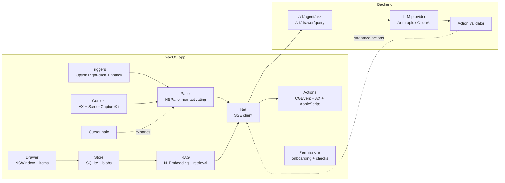

# Architecture

This document describes Pointer's high-level architecture. For specific
subsystems, see the source under [`mac/Sources/Pointer/`](../mac/Sources/Pointer/).

## Components

## Data flow on Option+right-click

1. `OptionRightClickDetector` sees a `.rightMouseDown` with the
   `kCGEventFlagMaskAlternate` flag set, consumes it, and posts the click
   point to the panel coordinator.
2. `AccessibilityExtractor` synchronously walks the AX tree from the
   element under the cursor, collecting role / value / title / parent
   window / app, redacting any `AXSecureTextField`.
3. `ScreenCapturer` grabs a region around the click via
   `ScreenCaptureKit` and downsamples to ≤ 768 px on the long edge.
4. `ChipsEngine` produces a 4–6 chip set from the AX role + app + selection
   state. The `PanelWindow` opens at the click point; the panel view
   focuses the first chip.
5. When the user picks a chip or types `/` and a free-text prompt, the
   `BackendClient` streams `POST /v1/agent/ask` over SSE. Tokens render
   into the panel as they arrive.

## Data flow for a drawer query

1. The user creates / opens a named drawer (`Cmd+Shift+D` or menu bar).
2. Items are added: drag-drop, paste, marquee-screenshot, or "Add to
   drawer" chip from any panel.
3. On ingest, the `Store` writes the file to a content-addressed blob,
   inserts metadata, runs the appropriate text extractor (PDF / DOCX /
   MD / code / OCR for images), chunks the text, and computes
   `NLEmbedding` vectors for each chunk.
4. On query: the prompt is embedded, top-K chunks (default K=8) are
   retrieved across the user's selected items, and the chunks plus raw
   images for the selected items are POSTed to `/v1/drawer/query`.
5. The LLM streams a citation-aware answer; citations are rendered as
   clickable pills back to the source items.

## Privacy posture

- The app captures **nothing** until the user explicitly triggers it
  (Option+right-click, hotkey, or drawer query).
- The Phase 4 ambient buffer is **on-device only**: a ring of the last
  ~10 seconds of cursor / app / window / element-under-cursor digests.
  It is summarized client-side into a short string before any send.
- Drawer items live on disk under
  `~/Library/Application Support/Pointer/drawers/` as content-addressed
  blobs. Embeddings and OCR stay on device. Only top-K chunks travel.
- The backend never persists request bodies. Streaming answers are not
  logged at the content level (only metric-level).

## Tech choices

| Layer            | Choice                                      |
| ---------------- | ------------------------------------------- |
| App language     | Swift 6                                     |
| App UI           | SwiftUI for views, AppKit for windowing     |
| Capture          | ScreenCaptureKit                            |
| Accessibility    | AXUIElement                                 |
| Local storage    | SQLite via GRDB.swift                       |
| On-device RAG    | NaturalLanguage `NLEmbedding`, VisionKit OCR|
| PDFs             | PDFKit                                      |
| Backend          | TypeScript + Hono on Node                   |
| LLM (primary)    | Anthropic Claude (vision + tool use)        |
| LLM (fallback)   | OpenAI                                      |
| Auth             | Sign-in-with-Apple                          |
| Billing          | Stripe (metered + free tier)                |
| Distribution     | Developer-ID-signed, notarized DMG          |
| Auto-update      | Sparkle                                     |

The macOS app is **not** sandboxed: full automation, low-level event
taps, and AppleScript bridging require entitlements that are
incompatible with the App Sandbox. The app is shipped as a notarized
direct download.

## Module boundaries

Each subdirectory under `mac/Sources/Pointer/` is a logical module
with a clear public API. Cross-module calls go through small protocol-
based interfaces so that:

- Modules can be tested in isolation with stub conformances.
- Phase work doesn't leak across boundaries (e.g. `Drawer` does not
  reach into `Triggers`; both use the `PanelCoordinator` to converge).
- Future extraction into a Swift Package per module is straightforward.

See each module's source file header comment for its API surface.
